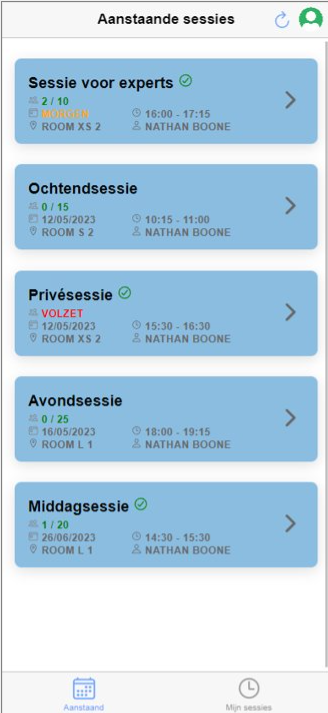
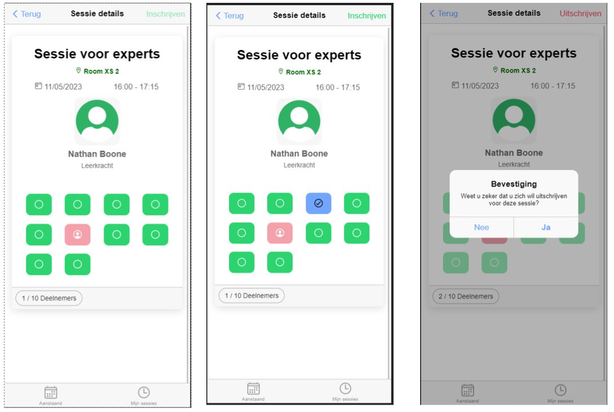
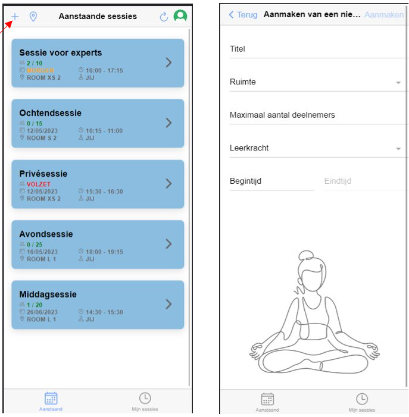
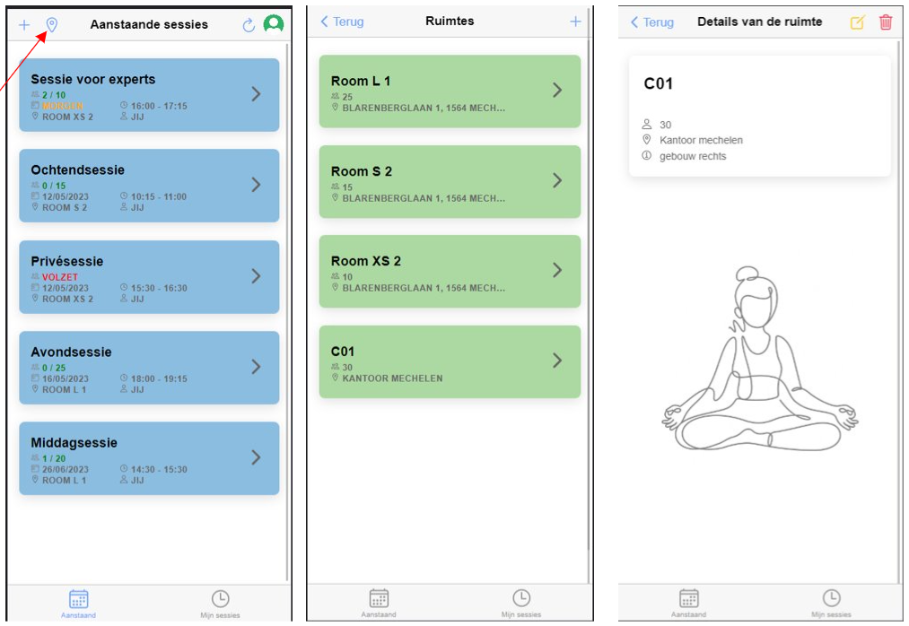

# YogApp frontend
## Technologieën
Voor de frontend van de YogApp wordt er gebruik gemaakt van de volgende technologieën:

Ionic
Angular
Typescript
Apollo (GrahpQL)
Belangrijk om te noteren voor dit deel van de YogApp is dat er gebruik gemaakt wordt van de smart-dumb logica.
Dit betekent dat we voor eke component(pagina) eigenlijk 2 componenten gaan aanmaken, eentje waar de logica inzit (smart) en dan in die folder een andere component, waarin de view zit (dumb). Het is de bedoeling dat alle logica in de smart component zit. Data wordt dan aan de dumb component meegegeven als volgt:

## Smart-Dumb logica

### Smart component
In de page.html van de smart component wordt de data meegegeven aan de dumb component op deze manier:
```
<ion-content id="main-content">
  <app-upcoming-sessions-view [receivedSessions]="sessions$ | async" [isLoading]="isLoading" (btnShowSessionsDetailsClicked)="onBtnShowSessionsDetailsClicked($event[0])"></app-upcoming-sessions-view>
</ion-content>
```

### Dumb component
deze data wordt dan in de component.ts file van de dumb component opgevangen als volgt:
```
@Input() receivedSessions: Session[] | undefined | null;
@Input() isLoading = false;
@Output() btnShowSessionsDetailsClicked = new EventEmitter<[string]>();
```
Het is dankzij de **@Output()** ook mogelijk om vanuit de dumb component data terug mee te geven aan de smart component (bijvoorbeeld form data)

# Screenshots
Some screenshots of the application

Startscreen for a user



Register for a session



Edit a session



Locations


